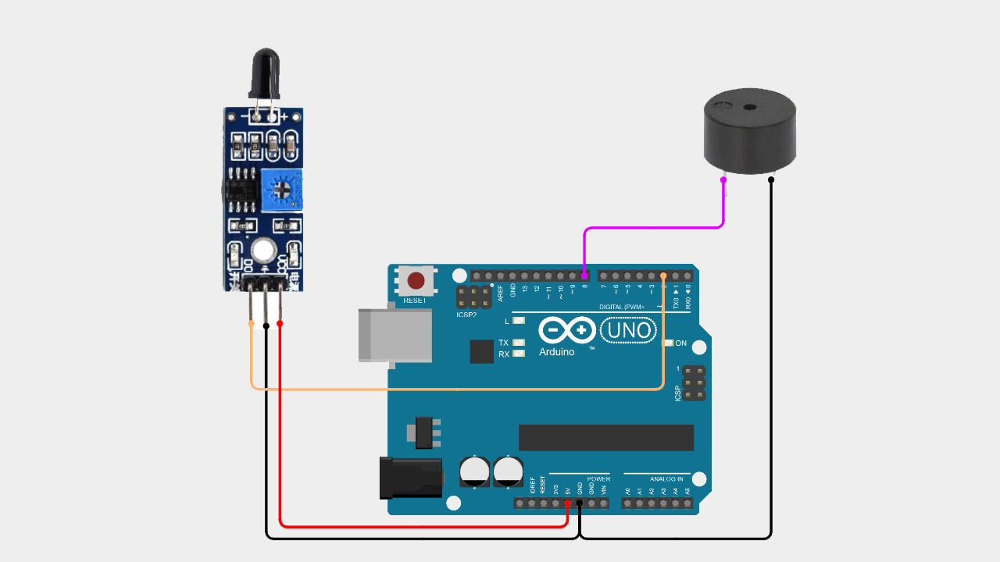

# Arduino Flame Sensor with Buzzer Alert

A beginner-friendly Arduino project to detect flame using a sensor and trigger a buzzer alarm.

This project uses a flame sensor module to detect fire presence and activates a buzzer as an alert system.

---

## 📌 Project Overview

A flame sensor detects infrared light emitted by fire.

When a flame is detected:
- The sensor outputs a LOW signal  
- Arduino reads the signal  
- The buzzer is activated as an alert  

This project is perfect for beginners who want to learn basic sensor input and output control.

---

## 🧰 Components Required

- Arduino Uno / Nano  
- Flame Sensor Module (KY-026 or similar)  
- Active Buzzer  
- Jumper Wires  
- Breadboard (optional)  

---

## 🔌 Wiring Connections

| Flame Sensor | Arduino |
|-------------|----------|
| VCC         | 5V       |
| GND         | GND      |
| DO          | Pin 2    |

| Buzzer | Arduino |
|--------|----------|
| (+)    | Pin 8    |
| (-)    | GND      |

---

## 📷 Wiring Diagram

> Make sure your wiring matches the diagram above before uploading the code.

---

## 💻 Arduino Code

You can download the Arduino sketch here:

[Download Arduino Code](Arduino_Flame_Sensor_with_Buzzer_Alert.ino)

Or open the `.ino` file directly inside this repository.

---

## 🚀 Getting Started

1. Connect all components according to the wiring table.
2. Upload the provided Arduino sketch.
3. Open **Serial Monitor**.
4. Set baud rate to **9600**.
5. Bring a flame (like a lighter) near the sensor.
6. The buzzer will sound when flame is detected.

---

## 🧠 Learning Concepts

This project helps you understand:

- Digital sensor input
- Fire detection basics
- Output control using buzzer
- Conditional logic (if-else)
- Serial monitoring

---

## 🎥 Video Tutorial

Watch the full step-by-step tutorial on YouTube:

In this video, you will see:
- Complete wiring demonstration  
- Code explanation  
- Flame detection testing  
- Buzzer alert response  

If this project helps you, consider subscribing for more beginner-friendly Arduino tutorials 🚀

---

## 📄 License

This project is open-source and free to use for educational purposes.

---

Happy Coding 🚀
